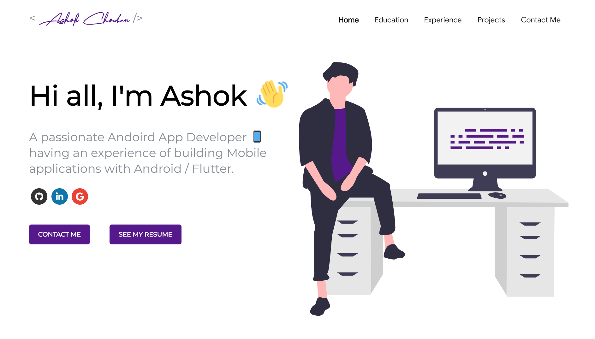

# Software Developer Master Portfolio ⚡️  

## A clean, beautiful and responsive portfolio template for Developers!

 
  <kbd>
  	<a href="https://ashok1708.github.io" target="_blank">
		</img>
	</a>
  </kbd>

If you want to **contribute** and make this much better for other developer have a look at [Issues](https://github.com/ashok1708/developer-portfolio/issues).

If you created something awesome and want to contribute then feel free to open Please don't hesitate to open an [pull request](https://github.com/ashok1708/developer-portfolio/pulls).

## Sections 
✔️ Summary and About me\
✔️ Skills \
✔️ Projects Connected with Github\
✔️ Experience\
✔️ Certifications 🏆\
✔️ Education\
✔️ Contact me

To view a live example, **[click here](https://ashok1708.github.io/)**

## Technologies used 🛠️

- [React](https://reactjs.org/)
- [graphql](https://graphql.org/) 
- [apollo-boost](https://www.apollographql.com/docs/react/get-started/) 

## illustrations
- [UnDraw](https://undraw.co/illustrations)

## Deployment 📦 
Once you have done with your setup. You need to put your website online!
I highly recommend to use [Github Pages](https://create-react-app.dev/docs/deployment/#github-pages) to achieve this on the EASIEST WAY

## License 📄

This project is licensed under the MIT License - see the [LICENSE.md](./LICENSE) file for details

## For the Future 
If you can help us with these. Please don't hesitate to open an [pull request](https://github.com/ashok1708/developer-portfolio/pulls).

- Move to Gatsby

- Add Podcast Section and Video Section

- Add tests to automate review.

- Setup Travis workflow.

## Contributors ✨

<!-- ALL-CONTRIBUTORS-LIST:START - Do not remove or modify this section -->
<!-- prettier-ignore-start -->
<!-- markdownlint-disable -->
<table>
  <tr>
    <td align="center"><a href="https://ashok1708.github.io/"> <b>Ashok Chouhan</b></a> <a href="https://github.com/ashok1708/developer-portfolio/commits?author=ashok1708" title="Code">💻</a> <a href="https://github.com/ashok1708/developer-portfolio/commits?author=ashok1708" title="Documentation">📖</a> <a href="#design-ashok1708" title="Design">🎨</a> <a href="#maintenance-ashok1708" title="Maintenance">🚧</a></td>
  </tr>
</table>

<!-- markdownlint-enable -->
<!-- prettier-ignore-end -->
<!-- ALL-CONTRIBUTORS-LIST:END -->

## References  

Some Design and Implementation Ideas are taken from [Saad Pasta's Portfolio Project](https://github.com/saadpasta/developerFolio).
"# personalFolio" 
"# developerPortfolio" 
